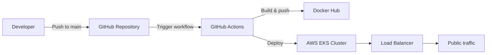
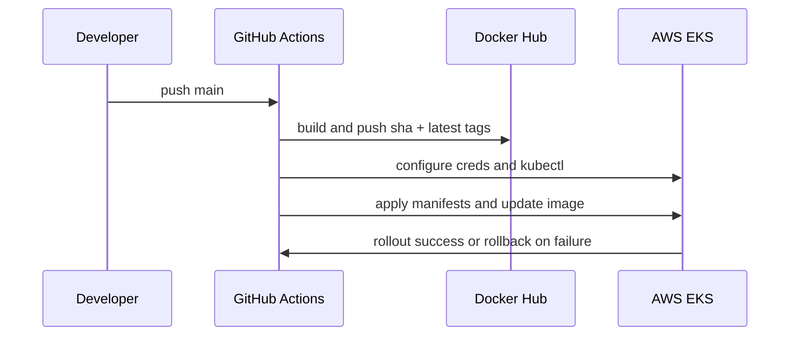

# AWS EKS Kubernetes Deployment

This repository demonstrates a production-ready AWS EKS deployment pipeline for a DevOps portfolio project. It combines Kubernetes manifests, Docker image management, and GitHub Actions CI/CD to deploy a containerized application to Amazon EKS.

## What this project demonstrates

- Immutable Docker image deployment with commit SHA tagging
- Automated GitHub Actions pipeline for build, push, and deploy
- Production Kubernetes best practices with rolling deploys and probes
- AWS EKS deployment with rollout verification and rollback
- Recruiter-ready documentation and operational guidance

## Architecture



## CI/CD workflow



## Project structure

- `kubernetes/` - Namespace, Deployment, and Service manifests
- `scripts/` - Local deployment helper scripts
- `.github/workflows/` - GitHub Actions CI/CD pipeline
- `.dockerignore` - Docker build context exclusions
- `README.md` - Project overview and deployment documentation

## Prerequisites

Before deploying, ensure the following are available:

- An AWS account with an existing EKS cluster
- Docker Hub account with repository access
- GitHub repository for this project
- GitHub Secrets configured for Docker and AWS credentials
- AWS access configured for the EKS cluster

## GitHub Actions Secrets

| Secret | Description |
|---|---|
| `DOCKERHUB_USERNAME` | Docker Hub username for image push |
| `DOCKERHUB_ACCESS_TOKEN` | Docker Hub access token or password |
| `AWS_ACCESS_KEY_ID` | AWS access key ID for deployment |
| `AWS_SECRET_ACCESS_KEY` | AWS secret access key for deployment |
| `EKS_CLUSTER_NAME` | Target EKS cluster name |

> The workflow uses `AWS_REGION=ap-south-2` explicitly and does not store credentials in source control.

## Least-privilege IAM permissions

Use an IAM principal with only the permissions required for deployment. Recommended actions include:

- `eks:DescribeCluster`
- `eks:ListClusters`
- `eks:DescribeNodegroup`
- `eks:DescribeUpdate`
- `sts:GetCallerIdentity`
- `iam:PassRole` (only if using role assumption)
- `ec2:DescribeSubnets`
- `ec2:DescribeSecurityGroups`

Avoid full administrator access. The deployment role should be scoped to read EKS cluster information and execute Kubernetes commands.

## Deployment flow

1. Push a commit to `main` or trigger the workflow manually.
2. GitHub Actions checks out the repository.
3. Docker Buildx builds the container image.
4. The workflow pushes both `${{ github.sha }}` and `latest` tags to Docker Hub.
5. AWS credentials and region are configured for `ap-south-2`.
6. `kubectl` is configured for the target EKS cluster.
7. Kubernetes manifests are applied for namespace, service, and deployment state.
8. `kubectl set image` updates the Deployment to the immutable SHA-tagged image.
9. The workflow waits for rollout completion.
10. If rollout fails, the workflow rolls back and exits with failure.

## Rollback procedure

The workflow automatically runs:

```bash
kubectl rollout undo deployment/portfolio -n devops
```

Manual rollback steps:

```bash
kubectl rollout undo deployment/portfolio -n devops
kubectl rollout status deployment/portfolio -n devops
```

For deeper diagnostics:

```bash
kubectl describe pod <pod-name> -n devops
kubectl logs <pod-name> -n devops
```

## Troubleshooting

- `Docker login failed`: verify Docker Hub secrets and repo permissions.
- `AWS credentials invalid`: confirm the AWS access key and secret are correct.
- `kubectl context not found`: ensure the EKS cluster name is correct and the cluster exists.
- `Rollout failed`: inspect pod logs and events for crash loops or configuration errors.
- `Image pull error`: confirm the image tags exist in Docker Hub and the cluster can access Docker Hub.

## Screenshots

Add screenshots for the following when available:

- GitHub Actions workflow success
- Docker Hub pushed image tags
- `kubectl get pods -n devops`
- `kubectl get svc portfolio-service -n devops`

## Interview questions

- Why is immutable image tagging with a commit SHA important for Kubernetes deployments?
- What are the benefits of `kubectl rollout status` in CI/CD?
- How does GitHub Actions cache improve Docker build performance?
- Why should AWS credentials be stored in GitHub Secrets rather than in the workflow?
- What is the difference between the `latest` image tag and the SHA tag?

## Lessons learned

- Automated rollback improves production reliability and reduces deployment risk.
- Commit SHA tagging makes each deployment traceable and repeatable.
- Docker build cache reduces pipeline runtime and resource usage.
- Minimal GitHub permissions and explicit AWS region settings improve security.
- Clear documentation and diagrams make the project easier for recruiters and reviewers to understand.
