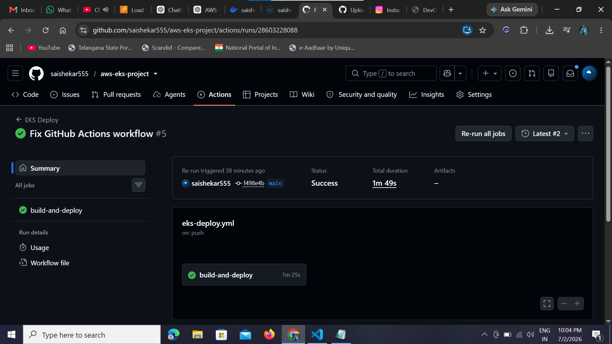
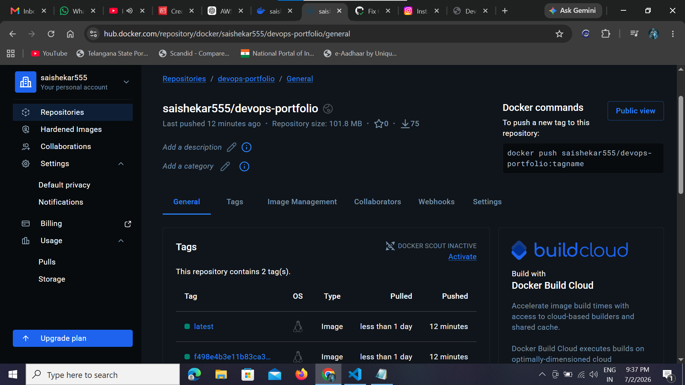
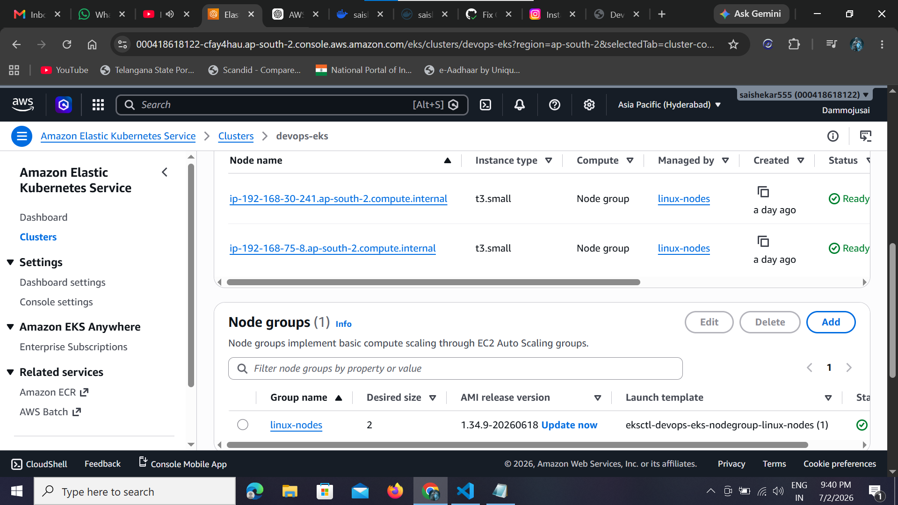
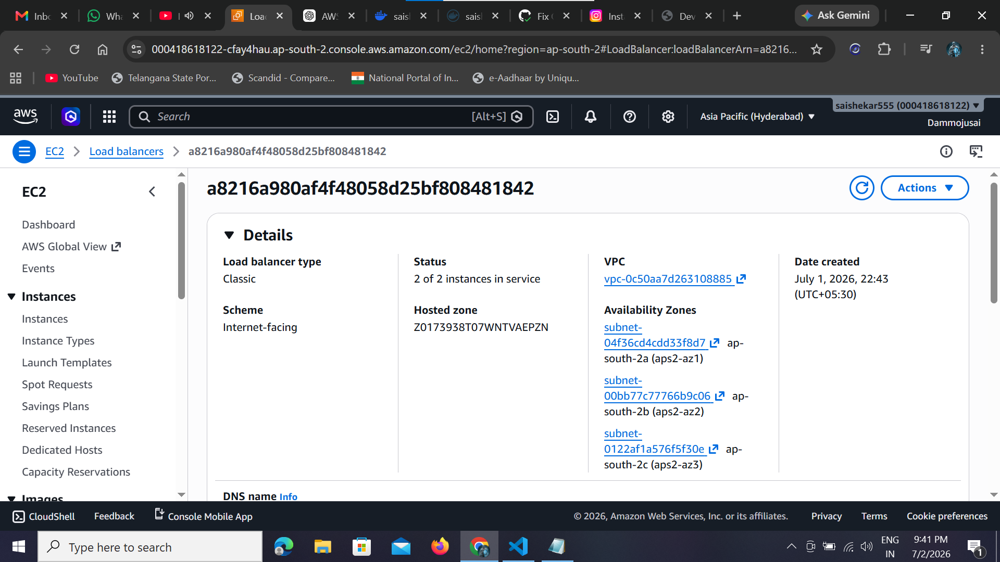
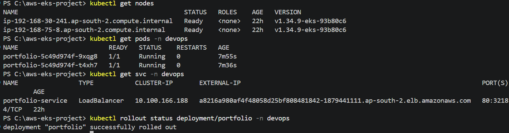
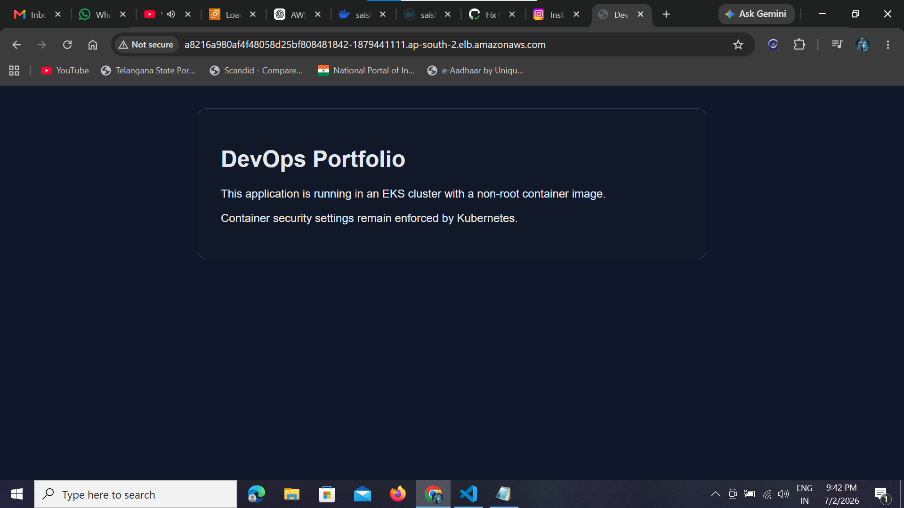

# 🚀 AWS EKS DevOps Portfolio Project

## 📌 Overview

This project demonstrates an end-to-end DevOps deployment pipeline using Docker, Kubernetes, Amazon EKS, GitHub Actions, and Docker Hub.

Every push to the `main` branch automatically:

- Builds a Docker image
- Pushes it to Docker Hub
- Connects to Amazon EKS
- Deploys the latest image
- Performs a rolling update
- Verifies deployment rollout

---

# 🏗 Architecture

GitHub
⬇
GitHub Actions
⬇
Docker Build
⬇
Docker Hub
⬇
Amazon EKS
⬇
Kubernetes Deployment
⬇
LoadBalancer
⬇
Live Application

---

# 🛠 Tech Stack

- AWS EKS
- Kubernetes
- Docker
- Docker Hub
- GitHub Actions
- AWS CLI
- kubectl
- Python
- Git

---

# 🚀 CI/CD Pipeline

✔ Code Push

↓

✔ GitHub Actions

↓

✔ Docker Build

↓

✔ Docker Hub Push

↓

✔ Update EKS Deployment

↓

✔ Rolling Update

↓

✔ Live Application

---

# 📂 Project Structure

```
aws-eks-project
│
├── .github/workflows/
├── kubernetes/
│   ├── deployment.yaml
│   ├── service.yaml
│   └── namespace.yaml
│
├── scripts/
├── terraform/
├── Dockerfile
├── index.html
└── README.md
```

---

# 📸 Project Screenshots

## GitHub Actions



---

## Docker Hub



---

## Amazon EKS



---

## Load Balancer



---

## Kubernetes



---

## Live Application



---

# 🌐 Live Demo

Application is deployed on Amazon EKS using a Kubernetes LoadBalancer.

---

# 🔒 Security

- Runs as Non-Root User
- Kubernetes Security Context
- GitHub Secrets
- AWS IAM Authentication

---

# 📈 Skills Demonstrated

- Docker
- Kubernetes
- Amazon EKS
- GitHub Actions
- CI/CD
- AWS CLI
- kubectl
- Linux
- DevOps
- Cloud Computing

---

# 👨‍💻 Author

**Sai Shekar**

Azure DevOps Engineer | AWS DevOps | Cloud Engineer

GitHub:

https://github.com/saishekar555
